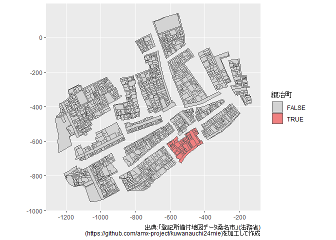

<!-- README.md is generated from README.Rmd. Please edit that file -->

# mojxmlr

<!-- badges: start -->

[](https://lifecycle.r-lib.org/articles/stages.html#experimental)
<!-- badges: end -->

法務省登記所備付地図データ（地図XML）をダウンロード・読み込むためのRパッケージです（非公式）．

利用にあたってはあらかじめ[利用規約](https://github.com/amx-project/kuwanauchi01hokkaido/blob/main/LICENSE.md)をご覧ください．

現在，以下のことに対応しています．

- [kuwanauchi](https://github.com/amx-project/kuwanauchi)を通じて地図XMLをダウンロードする
- 地図XMLファイルを[sf](https://r-spatial.github.io/sf/)オブジェクトとして読み込む
  - Python
    [mojxml2geojson](https://github.com/JDA-DM/mojxml2geojson)のR実装を目指したものです
  - `sf::write_sf()`を通じて`shp`や`gpkg`としても保存が可能です．

バグ報告やご要望は，[Issues](https://github.com/UchidaMizuki/mojxmlr/issues)にお願いします．

## インストール方法

mojxmlrの開発版は[GitHub](https://github.com/)からインストールすることができます。

``` r
# install.packages("devtools")
devtools::install_github("UchidaMizuki/mojxmlr")
```

## 使い方

``` r
library(mojxmlr)
library(dplyr)
#> 
#>  次のパッケージを付け加えます: 'dplyr'
#>  以下のオブジェクトは 'package:stats' からマスクされています:
#> 
#>     filter, lag
#>  以下のオブジェクトは 'package:base' からマスクされています:
#> 
#>     intersect, setdiff, setequal, union
library(fs)
library(ggplot2)
```

### 地図XMLのダウンロード

[kuwanauchi](https://github.com/amx-project/kuwanauchi)を通じて地図XMLをダウンロードします．

- `mojxml_find()`に市区町村コードを入力すると各市区町村の地番などが取得できます
- フィルタリングなどを行ったのちに`mojxml_download()`を適用するとデータがダウンロードされます
  - ダウンロードはXMLファイル単位で行われるため取得したい地番以外のデータも
    含まれる可能性があることにご注意ください

``` r
# 桑名市鍜冶町の地図XMLデータの取得
kuwana_kajimachi <- mojxml_find("24205") |> 
  filter(chiban_name == "桑名市鍜冶町")

kuwana_kajimachi
#> # MOJ XML: 80 × 5
#>    chiban_name  chiban_code chiban_name_undecided chiban_c…¹ datetime_output    
#>    <chr>        <chr>       <chr>                 <chr>      <dttm>             
#>  1 桑名市鍜冶町 3           <NA>                  <NA>       2022-02-07 14:01:00
#>  2 桑名市鍜冶町 3-1         <NA>                  <NA>       2022-02-07 14:01:00
#>  3 桑名市鍜冶町 3-2         <NA>                  <NA>       2022-02-07 14:01:00
#>  4 桑名市鍜冶町 3-3         <NA>                  <NA>       2022-02-07 14:01:00
#>  5 桑名市鍜冶町 3-4         <NA>                  <NA>       2022-02-07 14:01:00
#>  6 桑名市鍜冶町 3-5         <NA>                  <NA>       2022-02-07 14:01:00
#>  7 桑名市鍜冶町 4-1         <NA>                  <NA>       2022-02-07 14:01:00
#>  8 桑名市鍜冶町 4-2         <NA>                  <NA>       2022-02-07 14:01:00
#>  9 桑名市鍜冶町 4-3         <NA>                  <NA>       2022-02-07 14:01:00
#> 10 桑名市鍜冶町 4-4         <NA>                  <NA>       2022-02-07 14:01:00
#> # … with 70 more rows, and abbreviated variable name ¹​chiban_code_undecided

exdir_kuwana_kajimachi <- file_temp()
mojxml_download(kuwana_kajimachi,
                exdir = exdir_kuwana_kajimachi)

# 取得されたデータ (1ファイル)
path_file(dir_ls(exdir_kuwana_kajimachi))
#> [1] "24205-1923-1.xml"
```

### 地図XMLの読み込み

`read_mojxml()`で地図XMLファイルを[sf](https://r-spatial.github.io/sf/)オブジェクトや
データフレームとして読み込むことができます．

- 以下の読み込みタイプに対応しています
  - `type = "fude_polygon"`: 筆 (ポリゴン; デフォルト)
  - `type = "fude_point"`: 筆界点（ポイント）
  - `type = "fude_line"`: 筆界線（ラインストリング）
  - `type = "admin_line"`: 仮行政界線（ラインストリング）
  - `type = "map_info"`: 図郭（データフレーム）
- 任意座標系の場合はCRSが設定されないためご注意ください

``` r
file_kuwana_kajimachi <- dir_ls(exdir_kuwana_kajimachi)[[1L]]

# 筆（ポリゴン）
fude_polygon_kuwana_kajimachi <- read_mojxml(file_kuwana_kajimachi)
fude_polygon_kuwana_kajimachi
#> Simple feature collection with 2010 features and 14 fields
#> Geometry type: MULTIPOLYGON
#> Dimension:     XY
#> Bounding box:  xmin: -1260.868 ymin: -948.632 xmax: -131.689 ymax: 140.894
#> CRS:           NA
#> # A tibble: 2,010 × 15
#>    id         oaza_code chome_c…¹ koaza…² spare…³ oaza_…⁴ chome…⁵ chiban coord…⁶
#>  * <chr>      <chr>     <chr>     <chr>   <chr>   <chr>   <chr>   <chr>  <chr>  
#>  1 H000000001 021       000       0000    00      京町    <NA>    2      図上測…
#>  2 H000000002 021       000       0000    00      京町    <NA>    2-1    図上測…
#>  3 H000000003 021       000       0000    00      京町    <NA>    2-2    図上測…
#>  4 H000000004 021       000       0000    00      京町    <NA>    2-3    図上測…
#>  5 H000000005 021       000       0000    00      京町    <NA>    2-4    図上測…
#>  6 H000000006 021       000       0000    00      京町    <NA>    2-5    図上測…
#>  7 H000000007 021       000       0000    00      京町    <NA>    2-6    図上測…
#>  8 H000000008 021       000       0000    00      京町    <NA>    3      図上測…
#>  9 H000000009 021       000       0000    00      京町    <NA>    3-1    図上測…
#> 10 H000000010 021       000       0000    00      京町    <NA>    3-2    図上測…
#> # … with 2,000 more rows, 6 more variables: geometry <MULTIPOLYGON>,
#> #   version <chr>, map_name <chr>, city_code <chr>, city_name <chr>,
#> #   datum_type <chr>, and abbreviated variable names ¹​chome_code, ²​koaza_code,
#> #   ³​spare_code, ⁴​oaza_name, ⁵​chome_name, ⁶​coord_type

fude_polygon_kuwana_kajimachi |> 
  mutate(is_kajimachi = oaza_name == "鍜冶町") |> 
  ggplot(aes(fill = is_kajimachi)) +
  geom_sf() +
  scale_fill_manual("鍜冶町",
                    values = c(`TRUE` = "lightcoral",
                               `FALSE` = "lightgray")) +
  labs(caption = stringr::str_glue(
    "出典:「登記所備付地図データ桑名市」(法務省)\n(https://github.com/amx-project/kuwanauchi24mie)を加工して作成"
    ))
```


